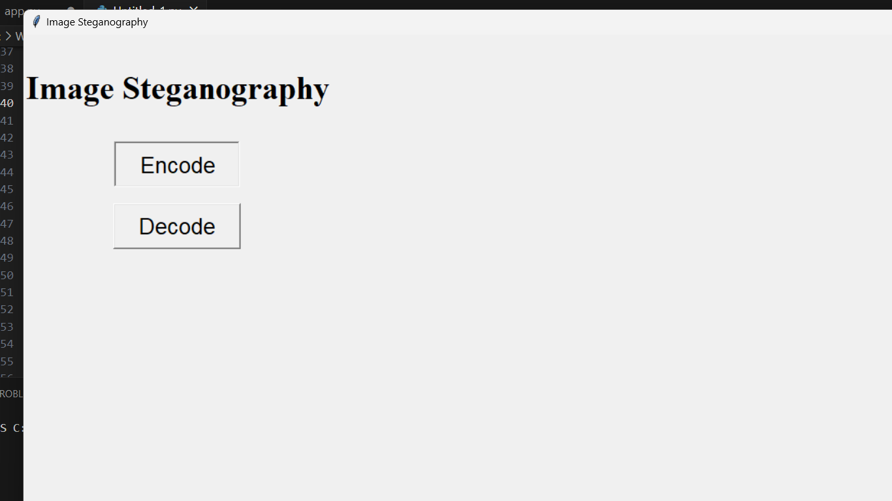
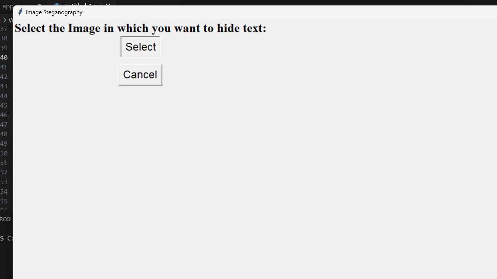
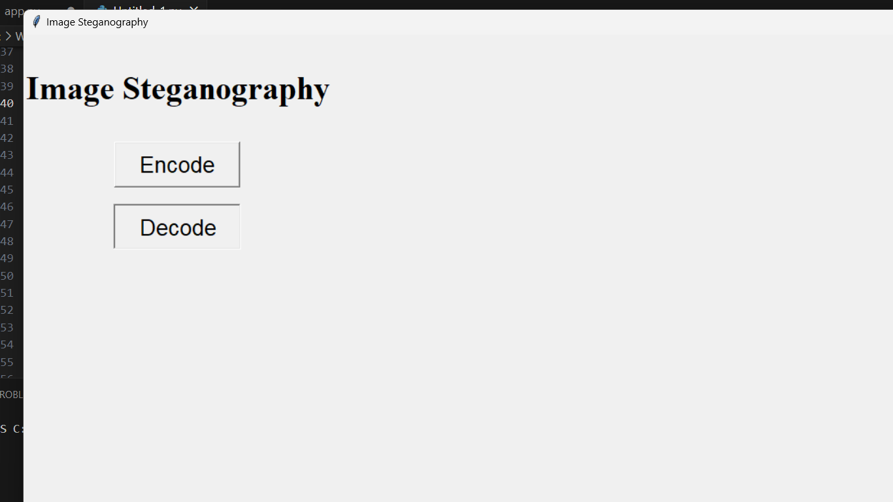
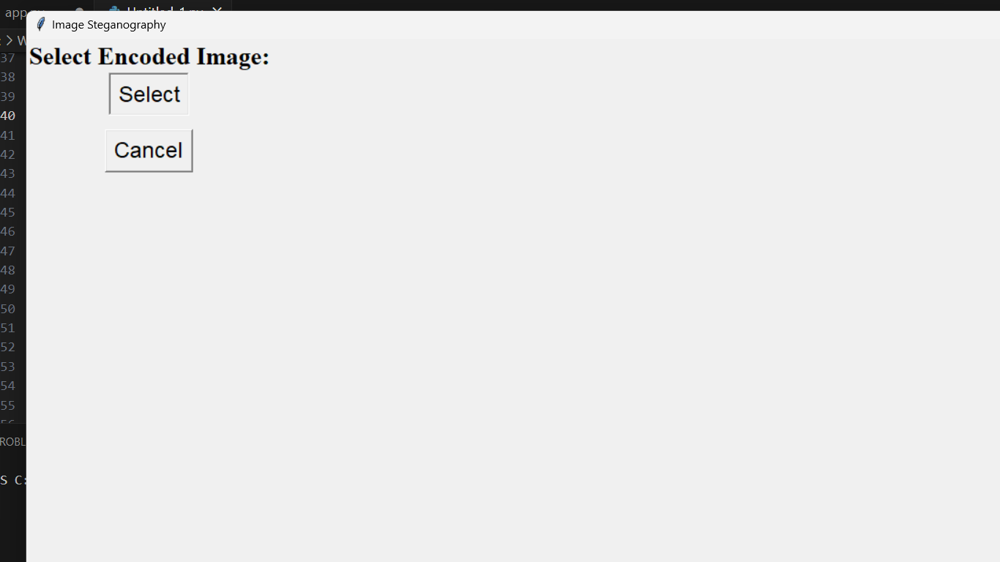

# Image Steganography Tool


A simple and user-friendly Python-based Image Steganography Tool that allows you to hide secret text messages within image files. This tool utilizes the least significant bit (LSB) method to embed and extract data from images. Keep your messages hidden in plain sight with this handy utility!

## Table of Contents

- [Features](#features)
- [Installation](#installation)
- [Usage](#usage)
- [Screenshots](#screenshots)
- [Contributing](#contributing)
- [License](#license)

## Features

- **Encoding**: Easily encode secret text messages into image files of various formats.
- **Decoding**: Decode hidden messages from encoded images.
- **User-Friendly Interface**: Intuitive graphical user interface (GUI) built with tkinter.
- **Cross-Platform**: Works on Windows, macOS, and Linux.

## Installation

1. Clone the repository or download the ZIP file:

   ```
   git clone https://github.com/pypi-ahmad/Image-Steganography-Tool.git
   ```

2. Navigate to the project directory:

   ```
   cd Image-Steganography-Tool
   ```

3. Install the required dependencies:

   ```
   pip install -r requirements.txt
   ```

## Usage

1. Run the application:

   ```
   python app.py
   ```

2. Use the GUI to select the image you want to encode data into or decode data from.
3. Encode data: Select the image, enter your message in the text box, and click the "Encode" button.
4. Decode data: Select the encoded image and click the "Decode" button.
5. Save the encoded image with a new name if desired.

## Screenshots


*Select an image to encode a secret message.*


*Encode the message into the selected image.*


*Select an encoded image to decode the hidden message.*


*View the hidden message decoded from the image.*

## Contributing

Contributions to this project are welcome. Feel free to open issues, submit pull requests, or provide feedback to help improve the tool.

## License

This project is licensed under the MIT License - see the [LICENSE](LICENSE) file for details.
